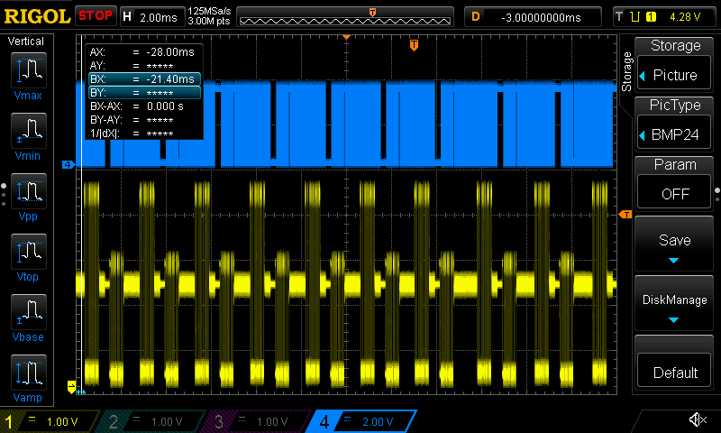

# ds1054z-cap

Captures the screen on a rigol DS1054Z over LAN and prints the result as a `.png`.

### Install 

``` 
git clone https://github.com/NateZimmer/ds1054z_cap_js.git ds1054z_cap_js
cd ds1054z_cap_js
npm install 
```

### Usage

```
node capture.js [IP] [optional filename]
```

Example:

```
node capture.js 192.168.1.110 myFile
```

Output: 

```
node capture.js 192.168.1.111 myFile
Connecing to 192.168.1.111 on port 5555
Connected
1124 KB
Wrote myFile.png
```

Example image:




### Info

See [capture.js](capture.js). Creates a basic TCP socket with the scope over port 5555. 